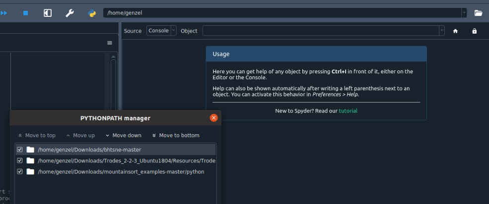

# Spikeinterface
## Installation of Spikeinterface

Create a new environment, Python need to be >=3.7

```
conda create --name environmnent
```
Activate you envinronment  
If you want to use spyder
```
conda install spyder=5
```
for spikeinterface installation
```
pip install spikeinterface[full]==0.93
```
for phy
```
pip install phy==2.0b1
```
For Mountainsor4 in spikeinterface
```
pip install mountainsort4
```
## Installation of Mountainsort

Create a new environment Python need to be be 3.6

```
conda create --name environmnentMS4 python=3.6
```
If you want to use spyder
```
conda install spyder=5
```
The install mountainsort package
```
conda install -c flatiron -c conda-forge mountainlab mountainlab_pytools ml_ephys ml_ms3 ml_ms4alg ml_pyms
```
Install spikeforest widgets
```
pip install spikeforestwidgets
```
Downloads the file named python and add it to the path

Click on the python icon in spyder to open pythonpathmanager click on add path and go to the downloads python file to add it


## Usage

### Spikeinterface

Activate the spikeinterface environment, you can run Readmdaspike.py (use f9 instead of run). For that you will need a raw.mda file (M*N array of channel by timestamps), a geom.csv file and params.json file, you can find example of geom and params in the master
It will import the raw in a recording apply a bandpass filter, do the spike sorting with mountainsort pipeline then export to phy the result.
You can use the phy GUI to visualise the result by typing in the kernel
```
!phy template-gui phy_MS/params.py
```
you will need to be in the directory where the file is created

### Mountainsort

Activate the environment that has mountainsort
You can run the MS4.py file   
To visualise the result you can use the GUI from mountainlab   
You can install qt-mountainview with
```
conda install -c flatiron -c conda-forge qt-mountainview
```
The command in kernel is :
```
!qt-mountainview --raw=./raw.mda --geom=./geom.csv --firings=./output2/ms4/firings.mda --samplerate=30000
```
## Potential Errors during installation/running

If you run into the error 
```
ImportError: cannot import name 'Selector' from 'phylib.io.array' (/home/genzel/anaconda3/envs/environmnent/lib/python3.9/site-packages/phylib/io/array.py)
```
### Solution
Go to https://github.com/cortex-lab/phy
Downloads the master and replace the phy file in /home/genzel/anaconda3/envs/environmnent/lib/python3.9/site-packages by the phy file in the master
